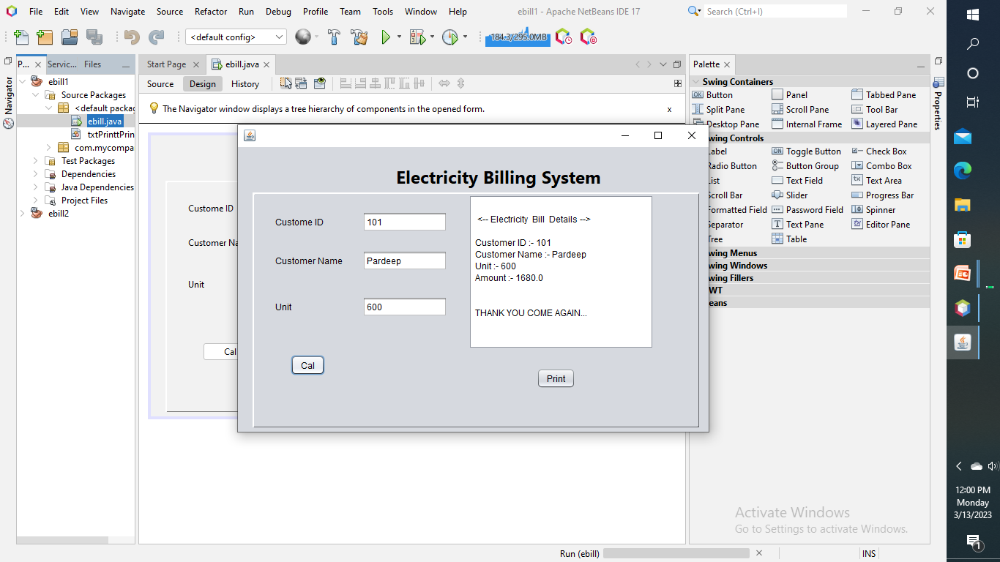
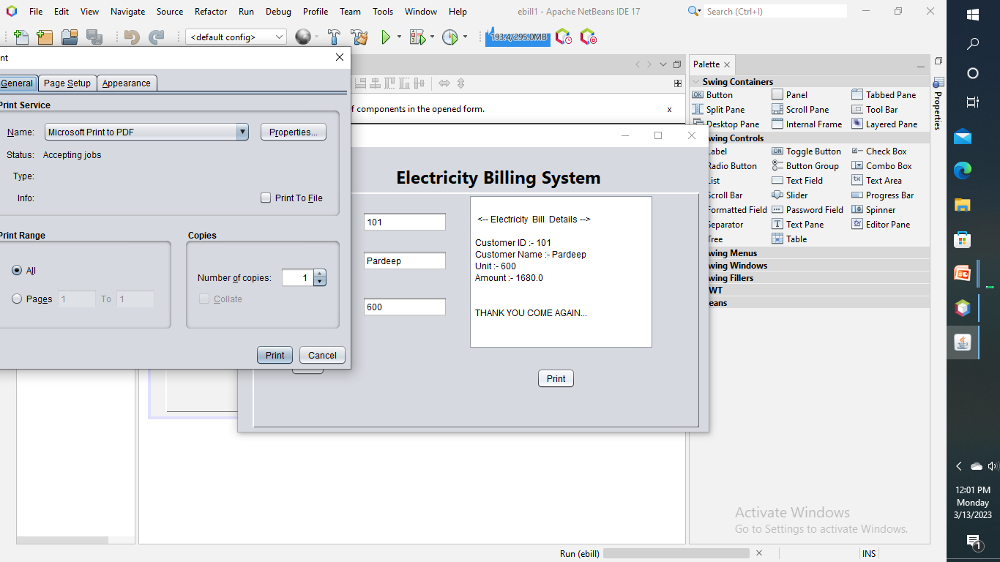
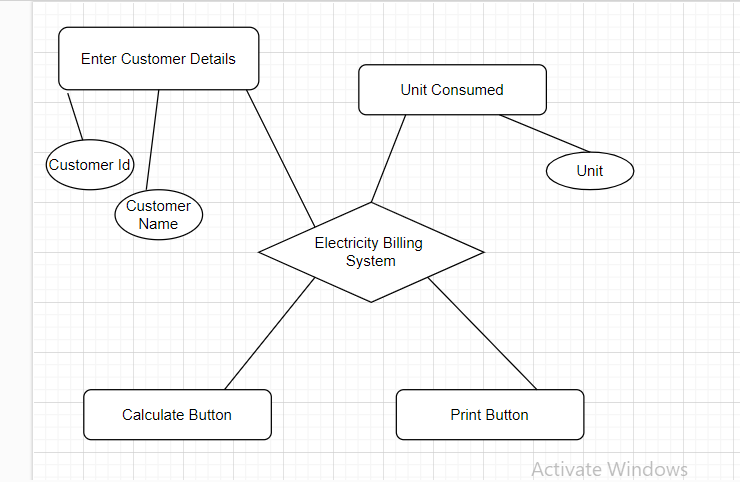

# Electricity-Billing-System
# 📝 Table of Contents
             About
             Getting Started
             Prerequisites
             Usage
             Flow Chart
             TODO
             Contributing
             Authors
             Acknowledgments
             Conclusion
## 🧐 About
The electricity billing system is a software-based project that is designed to manage the billing process of electricity consumption. It is developed to automate the traditional manual billing system and make the process efficient, accurate and fast. This project aims to create a system that will reduce the errors in manual billing, simplify the billing process, and provide users with a convenient way to pay their bills.
To develop an online system to electric bills for the calculate and printing the bill
After filling the proper details Calculate button calculate the total amount of the bill using code written in java format
To collect the power consumption Unit, customer Id and Customer Name
Print button print the details which is given in the customers details and total amount of the bill

##  🏁 Getting Started
These instructions will get you a copy of the project up and running on your local machine for development and testing purposes. See deployment for notes on how to deploy the project on a live system.

The system will have the following functionality:
### Text Field: - In this project there are three main text fields. In first one is Customer Id in which we have to fill Customer Id, in second one is for Customer Name in this we have to fill customer Name and in the third one is for Unit which is consumed by the customer.

    GUI Image 
    
             
    
            

### Cal Button: - Cal button calculate the gross amount of the unit which consumed by the customer and using java code it calculate the total bill amount. In this project for different - different unit range there is different rate of charge according to our given data.

         GUI Image 
         
         
              

### Print Button: - In print button it print the all detailed which was shown by the cal button like customer Id, Customer name, Unit, and Amount etc. 

               GUI Image 

               

               
               
               
              

## Prerequisites
What things you need to install the software and how to install them.
  	Window 10/XP
    Installed java editor 
    Installed java jre
  	Installed java jdk
    Installed Net Beans

## Installing
A step by step series of examples that tell you how to get a development env running.

Say what the step will be
 example
 step1 : Customer ID   =  101
         Customwr Name =  pardeep
         Unit          =  600
         
  step2 : Click on Cal Button or Calculate Button
  
   After clicking on this button it shows the customer details in text fiels
    <-- Electricity Bill Details --> 
        Customer ID :- 101
        Customer Name :- pardeep
        Unit :- 600
        Amount :- 1680.0
           THANK YOU COME AGAIN... 
step3 : when we click on print button it print the deatails of the customer
                  <-- Electricity Bill Details --> 
                           Customer ID :- 101
                           Customer Name :- pardeep
                           Unit :- 600
                           Amount :- 1680.0
                           THANK YOU COME AGAIN... 
  
## 🔧 Running the tests
       Right click on source code and select the ran file option .After that when project starts it shows the GUI and in which we filled the
       deatils and we g0t the output

## 🎈 Usage
       Right click on source code and select the ran file option .After that when project starts it shows the GUI and in which we filled the
       deatils and we g0t the output
       
       step1 : Customer ID   =  101
         Customwr Name =  pardeep
         Unit          =  600
         
  step2 : Click on Cal Button or Calculate Button
  
   After clicking on this button it shows the customer details in text fiels
    <-- Electricity Bill Details --> 
        Customer ID :- 101
        Customer Name :- pardeep
        Unit :- 600
        Amount :- 1680.0
           THANK YOU COME AGAIN... 
step3 : when we click on print button it print the deatails of the customer.

 ## ⛏️ Flow Chart
flow chart of this project

## Language Required
    ### Html
    ### Css
    ### java
       using NetBeans Editter
 ## ✍️ Author 
Pardeep Kumar
This project was created by me only

## 🎉 Acknowledgements
Search on Google
Showed videos on Youtube

## Conclusion 
     The electricity billing system project simplifies the billing process and provides a convenient way for customers to pay their bills. The 
Project can be implemented by utility companies to reduce errors and provide a reliable billing system for their customers. By automating the 
billing process, the system will save time and resources, resulting in better customer service and satisfaction.

                              # THANK YOU… 

Footer
